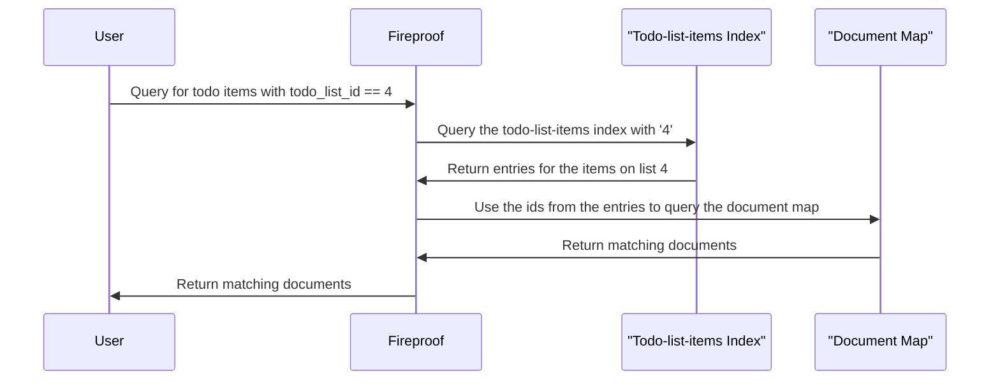
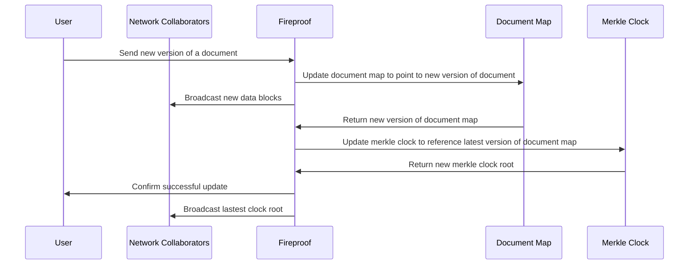
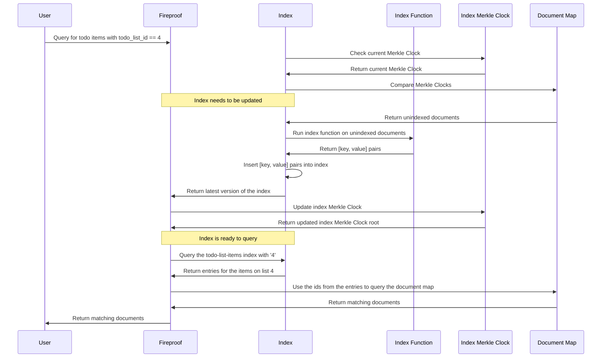
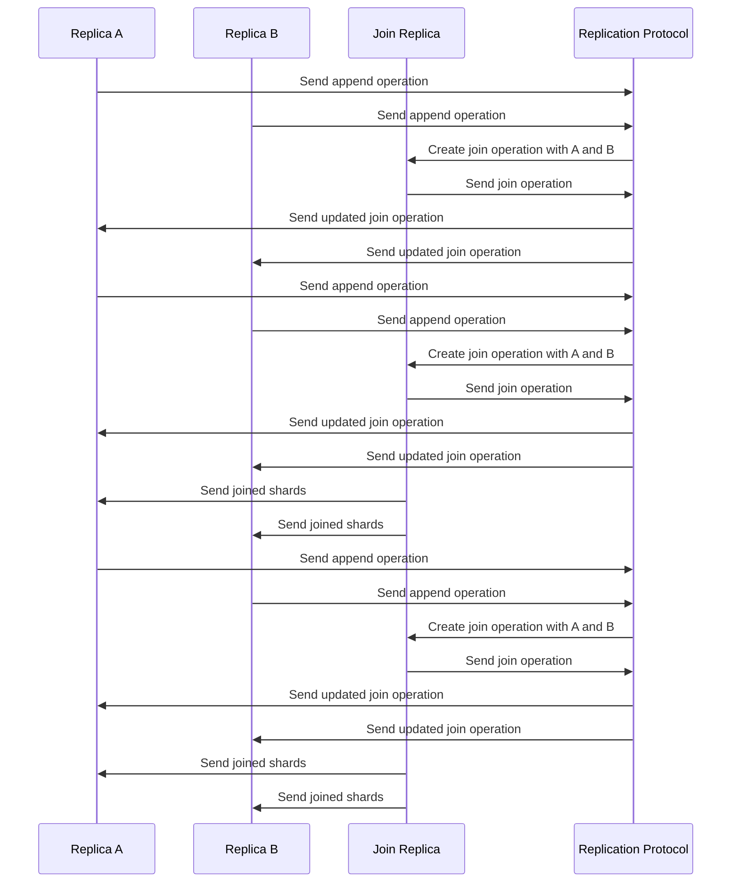
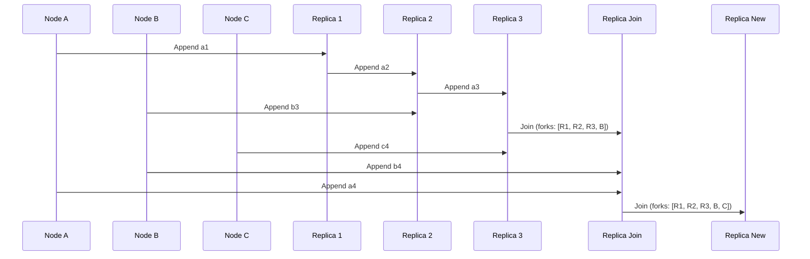
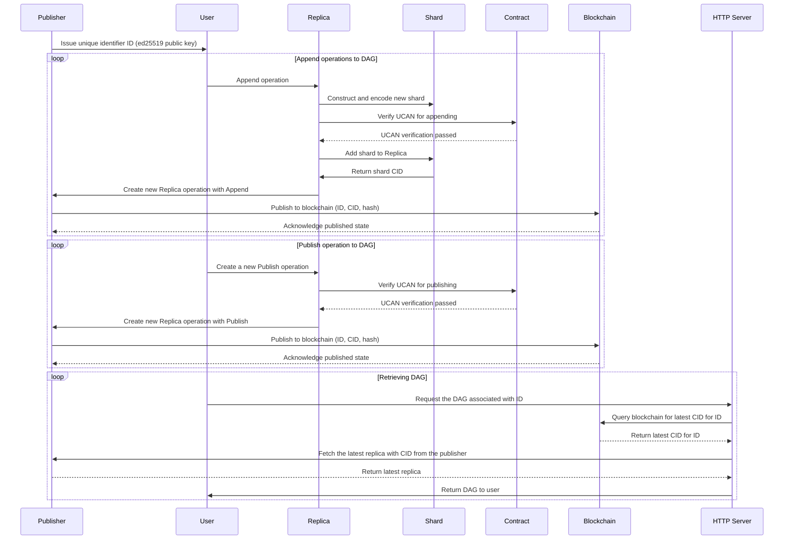

## Query flow

```mermaid
sequenceDiagram
    participant U as User
    participant F as Fireproof
    participant I as "Todo-list-items Index"
    participant D as "Document Map"

    U->>F: Query for todo items with todo_list_id == 4
    F->>I: Query the todo-list-items index with '4'
    I->>F: Return entries for the items on list 4
    F->>D: Use the ids from the entries to query the document map
    D->>F: Return matching documents
    F->>U: Return matching documents
```

## Update flow

```mermaid
sequenceDiagram
    participant U as User
    participant NC as Network Collaborators
    participant F as Fireproof
    participant DM as Document Map
    participant MC as Merkle Clock
    
    U->>F: Send new version of a document
    F->>DM: Update document map to point to new version of document
    F->>NC: Broadcast new data blocks
    DM->>F: Return new version of document map
    F->>MC: Update merkle clock to reference latest version of document map
    MC->>F: Return new merkle clock root
    F->>U: Confirm successful update
    F->>NC: Broadcast lastest clock root 
```

## Index update & query

```mermaid
sequenceDiagram
    participant U as User
    participant F as Fireproof
    participant I as Index
    participant IF as Index Function
    participant M as Index Merkle Clock
    participant D as Document Map
    
    U->>F: Query for todo items with todo_list_id == 4
    I->>M: Check current Merkle Clock
    M->>I: Return current Merkle Clock
    I->>D: Compare Merkle Clocks

Note over F,I: Index needs to be updated

    D->>I: Return unindexed documents
    I->>IF: Run index function on unindexed documents
    IF->>I: Return [key, value] pairs
    I->>I: Insert [key, value] pairs into index
    I->>F: Return latest version of the index
    F->>M: Update index Merkle Clock    
    M->>F: Return updated index Merkle Clock root

Note over F,I: Index is ready to query

    F->>I: Query the todo-list-items index with '4'
    I->>F: Return entries for the items on list 4
    F->>D: Use the ids from the entries to query the document map
    D->>F: Return matching documents
    F->>U: Return matching documents
```

### CRDT Join

```mermaid
sequenceDiagram
    participant A as Replica A
    participant B as Replica B
    participant J as Join Replica
    participant F as Replication Protocol
    
    A->>F: Send append operation
    B->>F: Send append operation
    F->>J: Create join operation with A and B
    J->>F: Send join operation
    F->>A: Send updated join operation
    F->>B: Send updated join operation
    A->>F: Send append operation
    B->>F: Send append operation
    F->>J: Create join operation with A and B
    J->>F: Send join operation
    F->>A: Send updated join operation
    F->>B: Send updated join operation
    J->>A: Send joined shards
    J->>B: Send joined shards
    A->>F: Send append operation
    B->>F: Send append operation
    F->>J: Create join operation with A and B
    J->>F: Send join operation
    F->>A: Send updated join operation
    F->>B: Send updated join operation
    J->>A: Send joined shards
    J->>B: Send joined shards

```

```mermaid

sequenceDiagram
    participant A as Node A
    participant B as Node B
    participant C as Node C
    participant R1 as Replica 1
    participant R2 as Replica 2
    participant R3 as Replica 3
    participant RJ as Replica Join
    participant RN as Replica New
    A->>R1: Append a1
    R1->>R2: Append a2
    R2->>R3: Append a3
    B->>R2: Append b3
    R3->>RJ: Join (forks: [R1, R2, R3, B])
    C->>R3: Append c4
    B->>RJ: Append b4
    A->>RJ: Append a4
    RJ->>RN: Join (forks: [R1, R2, R3, B, C])
```

## more

```mermaid
sequenceDiagram
    participant P as Publisher
    participant U as User
    participant R as Replica
    participant S as Shard
    participant C as Contract
    participant B as Blockchain
    participant H as HTTP Server
    
    P->>U: Issue unique identifier ID (ed25519 public key)
    
    loop Append operations to DAG
        U->>R: Append operation
        R->>S: Construct and encode new shard
        R->>C: Verify UCAN for appending
        C-->>R: UCAN verification passed
        R->>S: Add shard to Replica
        S->>R: Return shard CID
        R->>P: Create new Replica operation with Append
        P->>B: Publish to blockchain (ID, CID, hash)
        B-->>P: Acknowledge published state
    end

    loop Publish operation to DAG
        U->>R: Create a new Publish operation
        R->>C: Verify UCAN for publishing
        C-->>R: UCAN verification passed
        R->>P: Create new Replica operation with Publish
        P->>B: Publish to blockchain (ID, CID, hash)
        B-->>P: Acknowledge published state
    end

    loop Retrieving DAG
        U->>H: Request the DAG associated with ID
        H->>B: Query blockchain for latest CID for ID
        B-->>H: Return latest CID for ID
        H->>P: Fetch the latest replica with CID from the publisher
        P-->>H: Return latest replica
        H->>U: Return DAG to user
    end

```